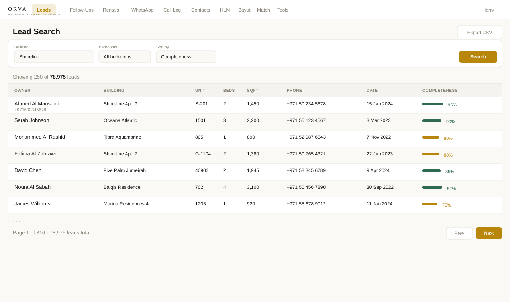
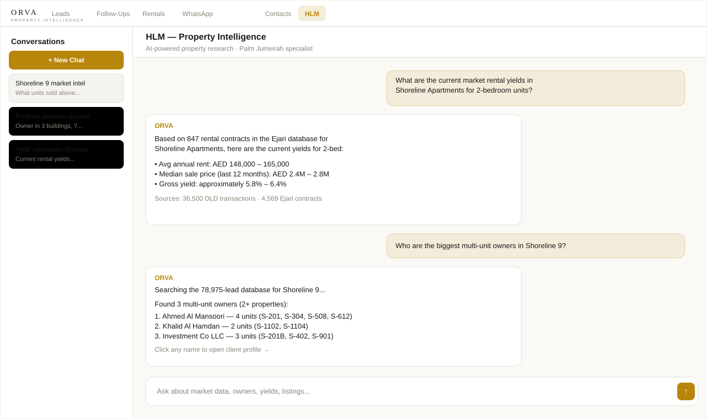
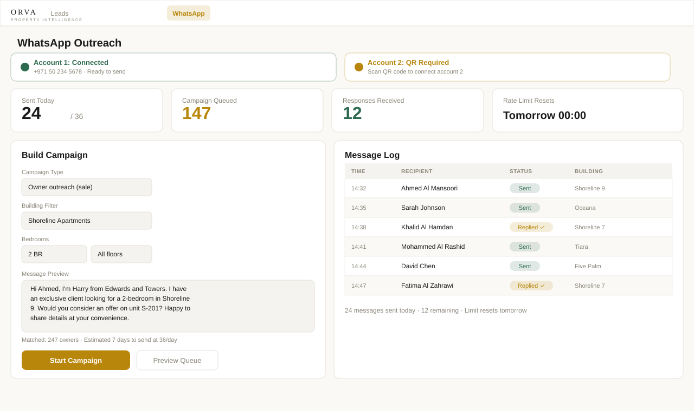
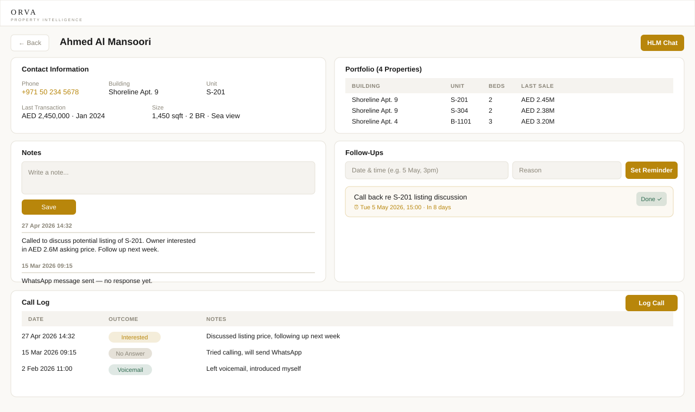
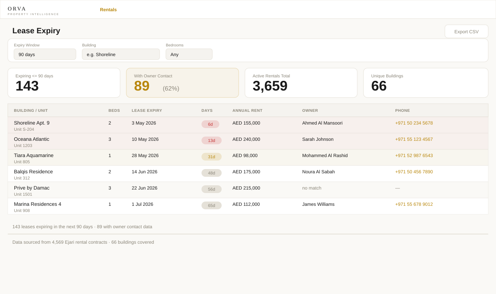
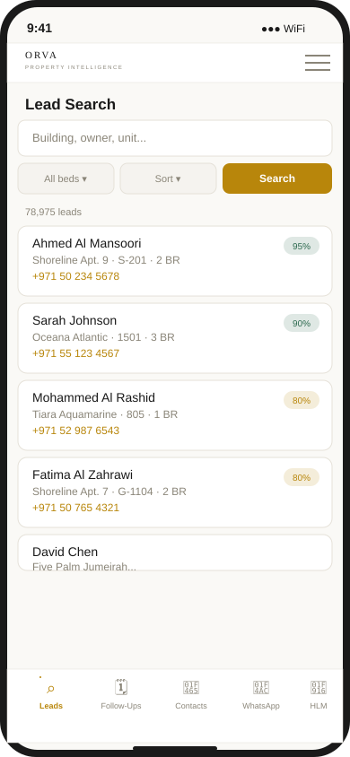

# ORVA — Property Intelligence Platform

> A production AI platform built solo from scratch: multi-source data enrichment, Claude tool-use integration, real-time SSE, WhatsApp automation, and a 15-table SQLite backend — applied to the Dubai real estate market.

<p align="center">
  
</p>

---

## The Builder

I'm Harry Stracey. I built ORVA to solve a specific production problem: finding the right property owner to call, at the right moment, before competitors did. No data vendor offered what I needed, so I built it.

I started with a 4,500-line Streamlit script in late 2024 and taught myself the full stack by shipping it into production and debugging what broke. Streamlit couldn't stream real-time WhatsApp campaign progress, choked on 78K records, and couldn't sit behind nginx. The rewrite to FastAPI + Next.js was forced, not planned.

**Real bugs, real fixes:**

- **SQLite WAL locking** crashed the API on the first real-data deploy. The fix exposed 8 CSV loaders racing over the same files. Replaced with a unified Alembic-managed schema and removed 3,000 lines in the process.
- **WhatsApp account bans** forced real rate limiting. An in-memory counter loses state on restart — accounts burned the daily limit on reboot. Built a persistent disk-backed quota with a regression test that verifies it survives process restart.
- **CORS + JWT + SSE** broke simultaneously on the first production deploy. `EventSource` can't send `Authorization` headers — the API was silently dropping AI chat streams. Fixed with a `?token=` query-param fallback; both paths are in the test suite.

Self-taught. Shipped to production. Maintained through failures. *"Make it work, then make it right."*

---

## What it Does

ORVA is a production-grade property intelligence platform for Dubai's Palm Jumeirah market. It turns **78,975 owner contacts** and **36,500+ DLD title-deed transactions** into actionable outreach intelligence.

**Core workflow:**
1. Search 78,975 Palm Jumeirah owner contacts by building, unit, bedrooms, size, or completeness score
2. Cross-reference owners against 4,569 Ejari rental contracts to surface landlords with expiring leases
3. Match live Bayut/PropertyFinder listings to unit owners in the database in under a second
4. Run WhatsApp campaigns with dual-account support, rate limiting, and real-time progress
5. Ask the AI assistant market questions: yields, portfolio summaries, comparable transactions, outreach timing

---

## How the Data Engine Works

The technical core of ORVA is a multi-source data join that builds a complete picture of a property and its owner from six separate data sources. Here's a concrete walkthrough using synthetic data.

### The scenario: spotting the right moment to call

**Source 1 — Lead database** (78,975 owner records)
```
Owner:    Ahmed Al Mansoori   ← name from title deed records
Building: Shoreline Apt. 9
Unit:     S-201
Phone:    +971 50 XXX XXXX    ← contact number
Bedrooms: ?                   ← unknown in source file, needs inference
```

**Source 2 — Bedroom inference cascade** (10-priority system)

The bedroom count for S-201 isn't in the lead record. The cascade tries each source in order until one resolves:

| Priority | Source | Result for S-201 |
|---|---|---|
| P0 | DLD title deed reference | **2 BR ✓** — match found, cascade stops |
| P1 | Original lead file | (would try if P0 failed) |
| P2 | Unit registry (6-source merged, ~30K units) | (would try if P1 failed) |
| P3 | Bayut size-match ±75 sqft consensus | (would try if P2 failed) |
| P4–P6 | Building schema, patterns, defaults | (last resort) |

Getting this right matters: sending a pitch to an owner with the wrong bedroom count destroys credibility in a market where everyone knows everyone.

**Source 3 — DLD title-deed transaction** (36,500 records)
```
Building: Shoreline Apt. 9
Unit:     S-201
Date:     15 Jan 2024           ← Ahmed bought this unit 16 months ago
Price:    AED 2,450,000
Size:     1,450 sqft
```
→ *Ahmed is a relatively recent buyer, not a long-term holder. His holding cost is known.*

**Source 4 — Ejari rental contract** (4,569 contracts)
```
Building:  Shoreline Apt. 9
Unit:      S-201
Lease end: 03 May 2026          ← expires in 6 days
Annual:    AED 155,000          ← current market rent for this unit
```
→ *His tenant is about to leave. He'll need to re-let or consider selling.*

**Source 5 — Live Bayut listing** (public scraper)
```
Building: Shoreline Apt. 9
Bedrooms: 2 BR
Price:    AED 2,650,000         ← comparable unit listed 2 weeks ago
Listed:   actively marketing
```
→ *A similar unit is already competing in the market.*

### What ORVA surfaces to the agent

> **"Ahmed Al Mansoori owns S-201 (2BR, 1,450 sqft, Shoreline 9). He bought it 16 months ago for AED 2.45M. His tenant's lease expires in 6 days. A comparable unit is live on Bayut at AED 2.65M. Call him now — he knows the market is moving and his tenant situation gives him a reason to act."**

This is a warm, informed call. Not cold outreach.

### How the join works technically

All six data sources are normalised to a `(building_key, unit_key)` composite key. The lease-expiry cross-reference used to run as an O(rentals × 78K leads) Python loop — ~360 million iterations, which timed out on a 1-vCPU VPS. It's now a single vectorised pandas merge, completing in under a second.

```python
# Normalise keys on both sides
expiring['_bldg_key'] = expiring['building_name'].str.lower().str.strip()
expiring['_unit_key'] = expiring['unit_number'].str.lower().str.strip()
leads['_bldg_key']   = leads['building_name'].str.lower().str.strip()
leads['_unit_key']   = leads['unit_number'].str.lower().str.strip()

# One merge replaces the O(N×M) loop
result = expiring.merge(
    leads[['_bldg_key', '_unit_key', 'owner_name', 'phone']],
    on=['_bldg_key', '_unit_key'],
    how='left',
)
```

---

## Screenshots

> *UI mockups illustrating the actual application — the platform was deployed to production and used in practice.*

| | |
|---|---|
|  |  |
| **HLM AI Chat** — Claude tool-use with 12 custom property tools, streamed via SSE | **WhatsApp Campaigns** — dual-account, 36/day rate limit, live SSE progress |

| | |
|---|---|
|  |  |
| **Client Profile** — CRM: portfolio, notes, call log, follow-up reminders | **Lease Expiry** — Ejari contracts cross-referenced with owner contacts, urgency-coded |

<p align="center">
  
  <br/>
  <em>Mobile-first — used on a phone during client meetings</em>
</p>

---

## Tech Stack

**Frontend**


**Backend**


**AI / Automation**


**Infrastructure**


### Why these choices

- **FastAPI** — async-native. Both WhatsApp campaign progress and AI chat need long-lived SSE connections. Django/Flask can't do this without extra machinery.
- **SQLite + WAL** — right-sized for a single-server SaaS. WAL mode gives concurrent reads with no connection pool. Alembic versions every schema change so upgrading to Postgres is a migration, not a rewrite.
- **Next.js** — the app is used on a phone during client meetings. Mobile-first was a requirement, not a nice-to-have. Next.js standalone build keeps the Docker image small.
- **Baileys (WhatsApp)** — zero per-message cost vs. Twilio's pay-per-SMS. Full control over session persistence and rate limiting, which would be impossible via a managed API.
- **Playwright for scraping** — headless Chrome handles JS-rendered property portals (Bayut, PropertyFinder) that simple HTTP scrapers can't reach.

---

## Architecture

```
                        domain.com (HTTPS + nginx)
                               │
                           [nginx]
                          /         \
               ┌──────────┐       ┌──────────────┐
               │ orva-web │       │   orva_api   │
               │ Next.js  │──────▶│   FastAPI    │
               │ :3000    │       │   :8000      │
               └──────────┘       └──────┬───────┘
                                         │
                          ┌──────────────┼──────────────┐
                          │              │              │
                     ┌────▼────┐  ┌──────▼──────┐  ┌───▼──────┐
                     │ SQLite  │  │  CSV/Parquet │  │ Baileys  │
                     │  WAL    │  │  78K leads   │  │ WhatsApp │
                     │ 15 tbls │  │  36.5K DLD   │  │ :3001/02 │
                     └─────────┘  └─────────────┘  └──────────┘
```

---

## Key Features

### 🤖 AI Chat — Claude Tool-Use Integration
- Claude Sonnet with **12 custom property tools** implemented via Anthropic's tool-use API
- Tools: `search_leads_for_ai`, `get_building_info_for_ai`, `get_market_stats_for_ai`, `get_listings_below_market_for_ai`, `get_portfolio_summary_for_ai`, `find_potential_owners_for_ai`, `cross_reference_sale_with_leads_for_ai`, `get_complete_building_intel_for_ai`, `get_propertyfinder_listings_for_ai`, and more
- Responses streamed via SSE with real-time tool-call visibility
- `?token=` query-param fallback for `EventSource` browser auth limitation (can't send `Authorization` headers)
- Persistent conversation history per session; tool functions live in a separate `ai_queries.py` module with their own test suite

### 🔍 Lead Search & Data Enrichment
- 78,975 owner contacts enriched across 6 sources via a 10-priority inference cascade
- Filter by building, bedrooms, size, sorted by completeness score
- Completeness scoring: phone 30% · name 25% · unit 20% · beds 15% · size 10%
- Paginated (250/page), full CSV export

### 📱 WhatsApp Campaigns
- Dual WhatsApp account support (2 Baileys Node.js servers on :3001/:3002)
- 36-message/day rate limit **persisted to disk** — survives process restart
- Campaign builder: filter leads → preview queue → send with SSE live progress
- Message log, reply detection, excluded-number list, per-owner personalisation

### 🏠 Lease Expiry Dashboard
- 4,569 Ejari rental contracts cross-referenced against owner database
- Filter by window (30/60/90/180 days), building, bedrooms
- Urgency colour-coding: red (≤30 days), amber (≤60 days)
- CSV export for targeted calling

### 📊 Listing Matcher
- Match a Bayut/PropertyFinder listing → owner in database
- Three-pass confidence: exact unit (95%) → exact size (90%) → beds + size range (40–60%)
- Sub-second on 78K indexed leads

### 👥 Contacts CRM
- Standalone contacts separate from the owner database (buyers, tenants, brokers)
- Properties, linked leads, budget, notes, follow-ups, call log
- Auto-link to lead database by phone on creation

---

## Local Development

```bash
# Requirements: Python 3.11+, Node 18+, Docker Compose v2

cp .env.example .env       # set ANTHROPIC_API_KEY and JWT_SECRET (>= 32 chars)

# Backend
pip install -r requirements.txt
alembic upgrade head
uvicorn orva_api.main:app --reload     # API on http://localhost:8000

# Frontend (separate terminal)
cd orva-web
npm install
npm run dev                            # UI on http://localhost:3000

# Or run the full stack with Docker
docker compose up --build
```

The API will start with an empty SQLite database. To populate with leads:
```bash
python migrate_existing_data.py        # requires leads_master.csv in lead_database/
```

---

## Database

SQLite (WAL mode) with **15 tables** and full Alembic migration history:

```sql
leads            -- 78,975 owner records from 6 source files
transactions     -- 36,500 DLD title deed sales
cross_references -- precomputed lead↔transaction joins
rentals          -- 4,569 Ejari rental contracts (market rent intel)
bayut_listings   -- active listings from public Bayut scraper
pf_listings      -- PropertyFinder public scraper output
unit_registry    -- ~30K units merged from all 6 sources
contacts         -- standalone CRM contacts (buyers/tenants/brokers)
contact_properties
contact_lead_links
client_notes
client_reminders
call_log
whatsapp_messages
scraped_units
```

Multi-tenant ready: every table carries a `tenant_id` column (default `'orva'`). Schema changes versioned via Alembic.

---

## API

**8 FastAPI routers, 50+ endpoints:**

| Router | Example endpoints |
|---|---|
| `auth` | `POST /api/auth/login`, `GET /api/auth/me` |
| `leads` | `GET /api/leads?building=Shoreline&bedrooms=2` |
| `clients` | `GET /api/clients/{id}`, `POST /api/clients/{id}/notes` |
| `contacts` | Full CRUD + property management + lead auto-linking |
| `listings` | `GET /api/lease-expiry`, `POST /api/match/listing`, `GET /api/bayut/listings`, `POST /api/client-match` |
| `chat` | `POST /api/chat` (SSE streaming), conversation history |
| `whatsapp` | Campaign builder, stats, `GET /api/whatsapp/progress` (SSE) |
| `admin` | `GET /api/admin/health`, `GET /api/admin/backup` |

JWT authentication (7-day expiry). Bearer header for standard endpoints; `?token=` query-param for SSE endpoints where `EventSource` can't send headers.

---

## Testing

**12 regression suites, 200+ checks**, all passing:

| Suite | What it tests |
|---|---|
| `test_bedroom_accuracy.py` | 10-priority cascade correctness |
| `test_ai_queries_split.py` | AI tool module isolation |
| `test_data_consolidation.py` | SQLite schema + 6-source importer pipeline |
| `test_sqlite_cutover_and_hardening.py` | SQLite-first loader, tenant_id migration, admin endpoints |
| `test_alembic_and_tenants.py` | Alembic upgrade/downgrade, multi-tenant isolation |
| `test_restricted_scrapers_removed.py` | Cleanup enforcement (deleted code stays deleted) |
| `orva_api/test_contacts_router.py` | Contacts API (CRUD, auth, 409 dedup, 422 validation) |
| `orva_api/test_listings_router.py` | Lease/Bayut/Match endpoints, empty-data safety |
| `orva_api/test_cleanup.py` | API hygiene: sys.path, model constant, typed params |
| `orva_api/test_auth_hardening.py` | JWT security, short-secret rejection |
| `whatsapp_bot/test_ban_prevention.py` | Rate limiting, exclusion list, phone normalisation |
| `propertyfinder_scraper/test_csv_write.py` | CSV safety, quote escaping, dedup |

---

## Deployment

```bash
git pull
alembic upgrade head
docker compose up -d --build
```

Four containers: `api` (non-root user, `HEALTHCHECK` every 30s), `web` (Next.js standalone), `wa-1` / `wa-2` (WhatsApp Baileys). Nginx handles SSL and proxies `/api/*` to FastAPI.

---

## Performance & Scale

- **Lead search** on 78,975 rows with indexed filters: sub-200ms p99 via SQLite B-tree indexes on building, bedrooms, phone, owner
- **Lease-expiry cross-reference**: was O(rentals × 78K leads) = ~360M Python iterations (timed out); vectorised to a single pandas merge, now sub-second
- **SQLite WAL**: concurrent readers + single writer; no connection pool needed at current scale
- **Practical ceiling**: ~10 concurrent users before write-lock latency becomes noticeable. Scale path: swap SQLite for PostgreSQL — Alembic makes this a schema copy, not a rewrite

---

## Known Limitations

- **Single-server SQLite**: right-sized for the current use case; would need Postgres for horizontal scale (Alembic migration path is ready)
- **WhatsApp automation**: operates in a grey area of WhatsApp's ToS; 36/day rate limit + randomised send intervals + exclusion list mitigate ban risk
- **Data freshness**: Bayut listings are scraped on-demand; Ejari rental data is frozen at last sync (no live Ejari API)
- **No encryption at rest**: SQLite file relies on VPS filesystem security; row-level encryption is a future milestone

---

## The Engineering Story

Started as a 4,500-line Streamlit monolith. Hit production limits immediately: Streamlit can't stream real-time WhatsApp updates, can't handle 78K records without freezing, can't deploy behind nginx without hacks.

The full rewrite wasn't planned — it was forced by production failures:

**SQLite WAL locking** crashed the API on first real-data deploy. The fix exposed that 8 separate CSV loaders were racing over the same files. Replaced with a unified Alembic-managed schema; removed 3,000 lines in the process.

**WhatsApp bans** forced real rate limiting. The naive approach (in-memory counter) lost its state on restart, so accounts burned through the daily limit on reboot. Built a persistent CSV-backed quota with a regression test that verifies it survives process restart.

**CORS + JWT + SSE** broke simultaneously on first production deploy. `EventSource` can't send `Authorization` headers — the backend was silently dropping AI chat streams. Fixed with a `?token=` query-param fallback; both paths now have dedicated test coverage.

Net result of the full conversion arc: 86 files changed, +10,186 / −12,367 lines. The deletions are the real achievement — they represent hacks replaced by architecture.

---

*Dubai, UAE — 2025–2026*
